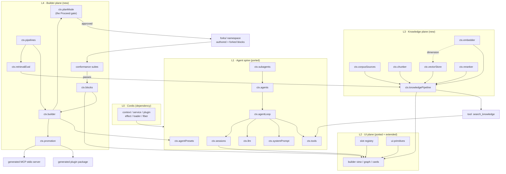

# Technical Architecture — Agentic Builder (SE373)

> **Status:** planning draft, pre-semester.
> **Package scope placeholder:** `@zoo/*`. Rename before phase 1; it appears in every manifest.
> **Upstream read pin:** `deepseek-ai/deepseek-harness` @ `b150a55` (v0.1.1-rc.2, 2026-08-21). Re-read against this commit only; upstream moves fast.

---

## 1. Thesis

A meta-agent that **builds agents**. The orchestrator composes subsystems from a catalog of pre-built, individually configurable blocks — tools, prompts, and a swappable RAG pipeline — then inspects, A/B-compares, and exports them as installable plugins.

Not a harness that does A. A harness for which **A is a subsystem it can build**.

The six archetypes SE373 names (Coding, Code Review, Requirement Analysis, Internal Knowledge, Multi-Agent Workflow, MCP Assistant) are **outputs of the system**, not the system.

### Design invariants

| # | Invariant | Consequence |
|---|---|---|
| I1 | The model authors **implementations**, never **seam contracts** | Seam definitions are hand-written; any provider may be forked or written fresh |
| I2 | A generated agent is **alive on arrival** | Every block declares a tier; defaults require no credentials |
| I3 | Swapping a stage is a **config-row edit**, never a code edit | Every stage is a seam |
| I4 | A pipeline is a **named, versioned value** | Diff, rollback, and A/B come free |
| I5 | The graph is **derived from the live runtime** | Visualization cannot drift |
| I6 | Every registration is a **reversible effect** | Cordis rule; unload must unwind cleanly |
| I7 | Authored code **mounts only after passing its seam's conformance suite** | Free authoring stays tractable because the contract is machine-checked |
| I8 | Building is **plan-gated** | Nothing is authored until the user approves an architecture plan |
| I9 | Every failure is **attributable and logged** | Package-namespaced logger, typed error codes, runtime invariant companions; no silent catch |

---

## 2. Layering

```
┌──────────────────────────────────────────────────────┐
│  L4  Builder plane        orchestrator, catalog,      │  ← we write
│                           promotion, export           │
├──────────────────────────────────────────────────────┤
│  L3  Knowledge plane      corpus→chunk→embed→store    │  ← we write
│                           →retrieve→rerank, eval      │
├──────────────────────────────────────────────────────┤
│  L2  UI plane             slots, primitives, views    │  ← port + extend
├──────────────────────────────────────────────────────┤
│  L1  Agent spine          sessions, llm, tools,       │  ← port (study first)
│                           agents, loop, prompt        │
├──────────────────────────────────────────────────────┤
│  L0  Cordis               context, service, plugin,   │  ← dependency, never port
│                           effect, loader, fiber       │
└──────────────────────────────────────────────────────┘
```

**L0 is a dependency.** Rewriting Cordis is the single decision that would consume the semester.

---

## 3. Port ledger

Every row is a decision. `docs/PORTING.md` tracks per-file provenance; MIT notice travels with any copied file.

### 3.1 Port near-verbatim

| dsh package | Why | Notes |
|---|---|---|
| `core/session` | The append-only `SessionEvent` log is the spine of everything downstream | Keep `deriveMessages()` semantics exactly |
| `llm/llm` | Stream/message vocabulary is boring and load-bearing | Adapter seam only; write our own adapter |
| `client/ui-slots` | Slot registry with cardinality + shadowing | Our whole UI-morph thesis rests on it |
| `client/ui-primitives` | Styled, **zero-cordis** React atoms | Zero-cordis = injectable into a sandbox closure |
| `core/scope` | Per-agent scoped registration | Needed before subagents |
| `vendor/hmr` | Plugin hot reload — accept/decline graph, dual cache clear, rollback | Vendored Cordis plugin; take as-is, do not reimplement |

### 3.2 Study, then rewrite smaller

| dsh package | What to keep | What to drop |
|---|---|---|
| `core/agent-loop` | turn/step model, `agent/pre-step` waterfall | steering, goals, continuation |
| `core/tools` | register → pre-policy → guard → dispatch → post-policy | Code Mode transport |
| `core/system-prompt` | section + schema assembly | i18n |
| `boot/app-boot` | profile → bundle → patch layering | profile healing, module fallback symlinks |
| `preset/agent-presets` | preset dir → scoped mount, **`isolate` realm rule** | trusted/user root discovery |
| `plan/plan-mode` | durable `plan/mode` event, `/plan`, reviewed `exit_plan_mode` | deployment-owned guidance text |

### 3.3 Skip entirely

> **Superseded 2026-08-26.** This list was written when the plan assumed we
> would port ~12 packages by hand, so every extra package was a cost. Under
> vendoring the calculus inverts: we take dsh's own `bundle/base`, which is
> upstream's answer to "what a working harness needs" and covers four SE373
> topic areas this list was discarding (memory/compaction, skills, workflow,
> security/sandbox). 187 of 227 packages are taken; the 40 exclusions all need
> external infrastructure. Anything vendored but unwanted is a `disabled: true`
> row. See `docs/PORTING.md` §2. The list below is kept as the record of what
> was decided before that measurement.


`compaction/*`, `spill/*`, `lsp/*`, `acp/*`, `e2b/*`, `terminal/*` (PTY), `code-runtime/*`, `typert/*`, `session-projection*`, `client/ui-trajectory`, `hooks/*`, i18n, and 5 of the 6 `subagent-*` backends (keep `subagent-spawn-in-process`).

> ~50 upstream packages. Roughly 12 are on our path.

### 3.4 Write ourselves — this is the project

L3 and L4 in full. See §5 and §6.

---

## 4. Ported spine — service map

Keys we reproduce, with upstream role preserved.

| ctx key | Role | Owner (ours) | Notes |
|---|---|---|---|
| `ctx.sessions` | core | `@zoo/session` | append-only log + event feed |
| `ctx.llm` | seam | `@zoo/llm` | providers: `llm-deepseek` |
| `ctx.tools` | core | `@zoo/tools` | registry + guarded pipeline |
| `ctx.systemPrompt` | core | `@zoo/system-prompt` | sections + tool schemas |
| `ctx.agents` | core | `@zoo/agent` | live handles, create/resume |
| `ctx.agentLoop` | bundle | `@zoo/agent-loop` | the one driver |
| `ctx.fs` | seam | `@zoo/fs` | providers: `fs-local` |
| `ctx.shell` | seam | `@zoo/shell` | providers: `bash-local` |
| `ctx.subagents` | seam | `@zoo/subagent` | provider: `spawn-in-process` |
| `ctx.agentPresets` | core | `@zoo/agent-presets` | **isolate realm enforcement lives here** |
| `ctx.settings` / `ctx.credentials` | seam | `@zoo/settings`, `@zoo/credentials` | config carries refs; providers own values |

### Turn flow (preserved from upstream)

```
turn/start
  claim input → assemble prompt sections + tool schemas
  agent/pre-step          [waterfall] reject | enter(messages)
  step/start
    agent/request → llm/stream → assistant/chunk* → assistant/message
    tool/call* → tools/pre-execute → tools/execute → tools/post-execute → tool/result*
  step/end
  agent/turn-stopping     [serial]
turn/end
```

**Rule inherited: model-visible means logged.** Anything reaching a model request must be reconstructable from the session log.

---

## 5. Knowledge plane (L3) — new seams

### 5.1 The composition rule

> **Cardinality decides the mechanism.**
> Exactly one at a time, swap = replace → **seam** (service definition + provider + consumer).
> Several stack, ordered, each optional → **waterfall event**.

Stages do not share a type (`Document → Chunk[]` vs `(Query, Hit[]) → Hit[]`), so a single homogeneous chain is the wrong model.

### 5.2 Seams (pick exactly one)

| ctx key | Role | Owner | Providers (planned) | Tier | Index-invalidating |
|---|---|---|---|---|---|
| `ctx.corpusSources` | seam | `@zoo/corpus` | `corpus-fs`, `corpus-git`, `corpus-http` | ready / blocked | yes |
| `ctx.chunker` | seam | `@zoo/chunker` | `chunker-recursive`, `chunker-markdown` | ready | **yes** |
| `ctx.embedder` | seam | `@se373/embedding` | **`embedder-onnx-local`** ✅, `embedder-api` | ready | **yes** |
| `ctx.vectorStore` | seam | `@se373/vector-store` | **`vs-sqlite-vec`** ✅, `vs-lancedb`, `vs-qdrant` | ready | n/a |
| `ctx.reranker` | seam | `@zoo/rerank` | `rerank-none`, `rerank-cross-encoder` | defaulted | no |
| `ctx.knowledgePipeline` | core | `@zoo/knowledge` | — (composed) | — | — |

~~**`ctx.embedder` is the critical-path package.**~~ **Built 2026-08-29, `phase-6a`.** The paragraph below was right about the gap and wrong about the cost: the ONNX export emits `sentence_embedding`, so pooling and normalization are inside the graph and the risky part — hand-rolled pooling — never had to be written. The original note:

> **`ctx.embedder` is the critical-path package.** Upstream has no embeddings seam of any kind — `packages/llm` ships chat adapters only (`llm-deepseek`, `llm-pi-ai`, `llm-retry`, `token-meter`). The shared model router does **not** cover embeddings. Build it in phase 6a, before anything that depends on retrieval.

Default `embedder-onnx-local`: in-process ONNX, no API key, no router. Preserves I2.

### 5.3 Waterfalls (stack many)

| Event | Mode | Signature | Example listeners |
|---|---|---|---|
| `knowledge/pre-retrieve` | waterfall | `Query → Query` | query rewrite, HyDE, ACL/tenant filter |
| `knowledge/post-retrieve` | waterfall | `Hit[] → Hit[]` | dedup by doc, MMR diversity, budget truncation |

Cordis waterfall is around-middleware: a listener receives `(...args, next)`, calls `next()` to delegate or returns without it to short-circuit.

### 5.4 Durable ingest events

Following the conversation-node contract — one stable business id, replayable, every event carries it.

| Event | Role | Required facts |
|---|---|---|
| `ingest/start` | unique start | `ingestId`, source ref, block config revision |
| `ingest/progress` | update | `ingestId`, documents/chunks counters |
| `ingest/end` | update | `ingestId`, totals, terminal status |

Rendered as one Chat node via a `ConversationNodeDefinition` + keyed renderer.

### 5.5 Destructive config changes & index generations

A change to any **write-path** stage invalidates the index. Handled as a first-class destructive operation, not a warning.

#### Invalidation cascades positionally

The write path is ordered `corpusSource → chunker → embedder → vectorStore`. A change at stage N invalidates N…end and nothing before it.

| Changed stage | Re-crawl | Re-chunk | Re-embed | Rewrite store |
|---|---|---|---|---|
| `corpusSource` | ✅ | ✅ | ✅ | ✅ |
| `chunker` | — | ✅ | ✅ | ✅ |
| `embedder` | — | — | ✅ | ✅ |
| `vectorStore` | — | — | — | ✅ |
| `reranker`, `knowledge/*` waterfalls | — | — | — | — (read path) |

Embedding dominates the cost; chunking does not. With chunks cached, an embedder swap skips crawl and chunk entirely. Full rebuild is the degenerate case where stage 0 changed — implement the cascade and both fall out.

#### Generations: build alongside, flip, then drop

**Never destroy in place.** Tearing down the live index leaves the agent dead until re-ingest completes.

```
current: gen-A  (serving)
change  → build gen-B alongside     (agent keeps answering from gen-A)
        → atomic pointer flip        (gen-B serving)
        → drop gen-A                 (dispose handles, I6)
```

One mechanism, three features:

| Feature | How generations deliver it |
|---|---|
| No downtime on a destructive change | old generation serves until the flip |
| Index rollback | flip the pointer back; I4's promise extends from pipelines to indexes |
| **Write-side A/B** | gen-A and gen-B coexisting **is** the two-index comparison of §6.3 |

Drop rules: in-flight queries against the retiring generation drain or cancel before disposal; disposal releases store handles through the owning effect.

#### The generation key is a fingerprint, not a flag

`indexInvalidating` in a block manifest is a **UI hint only** ("this change rebuilds your index, ~4 min").

The **authority** is a computed hash of the resolved write-path config:

```
genKey = hash(sourceRef, chunkerId+config, embedderId+config+dims, storeSchemaVersion)
```

Staleness is computed, never declared. This is load-bearing because §6.5 lets the model author and fork blocks: an authored block can omit or misstate a boolean, and a flag-based system would then serve from a poisoned index with no error. A fingerprint cannot be forged by forgetting a field.

A query whose live `genKey` does not match the store's recorded one **fails closed** rather than answering.

#### Approval

A destructive change is gated like any other side-effecting operation: the plan card (§6.5) states which stages rebuild, the estimated duration, and the generation being replaced, before work starts.

### 5.6 Consumer boundary

`search_knowledge` injects **`ctx.knowledgePipeline` only** — never an individual stage. Any stage swap is then invisible to the tool, and the tool never needs regenerating.

---

## 6. Builder plane (L4) — new seams

| ctx key | Role | Owner | Responsibility |
|---|---|---|---|
| `ctx.blocks` | core | `@zoo/block-registry` | Registry of named blocks: manifest, config schema, tier, deps |
| `ctx.pipelines` | core | `@zoo/pipeline-registry` | Registry of **named, versioned** row-sets (specs, not runtimes) |
| `ctx.builder` | core | `@zoo/builder` | Intent → resolved agent spec (preset + blocks + prompt + config) |
| `ctx.retrievalEval` | seam | `@zoo/eval` | Scores a pipeline version against a pinned question set |
| `ctx.promotion` | core | `@zoo/promotion` | Resolved spec → durable plugin package on disk |

### 6.1 The block manifest

One file per block. Kills three problems at once — dependency declaration (which Cordis forces anyway), tiering, and config schema.

```jsonc
{
  "id": "vector-store.sqlite-vec",
  "seam": "ctx.vectorStore",
  "role": "provider",
  "tier": "defaulted",            // ready | defaulted | blocked
  "indexInvalidating": false,   // UI hint only — the write-path fingerprint is authoritative (§5.5)
  "inject": ["fs"],               // Cordis service deps
  "requires": [],                 // credentials/config that must be filled
  "configSchema": { /* schemastery */ },
  "defaults": { "path": ".zoo/index.db" }
}
```

**Tier semantics (invariant I2):**

| Tier | Meaning | UI state |
|---|---|---|
| `ready` | no config at all | active |
| `defaulted` | runs on an embedded local default | active, "configure" affordance |
| `blocked` | genuinely needs a secret | **visibly inert**, "connect" affordance |

A generated agent boots and runs on `ready` + `defaulted`. Connecting external systems **upgrades** it; it never **enables** it.

### 6.2 Pipelines as values

A pipeline version is a **named row-set** (a patch fragment), stored as a directory + git. Not a database.

- **diff** — new vs old renders as a config diff, deterministic
- **rollback** — a prior version is still a named artifact
- **orchestrator edits** — the agent emits version `n+1`; it never mutates state

### 6.3 A/B via `isolate` realms

Two pipeline versions live simultaneously by publishing `ctx.knowledgePipeline` behind **entry-local `isolate` realms** — upstream's own words: *"entry-local realms keep two presets' same-named services apart exactly as they once kept two sessions' apart."*

> **Failure mode to guard at registration:** a row publishing into the **root** realm is process-global; the second version collides with the first and a host reader resolves one instance for everybody. Upstream's preset package re-checks this on every service notification. **Copy that invariant check.** Fail loud at load, not at demo.

#### Isolate what differs; share what is underneath

The isolation boundary wraps the **pipeline composition**, not the leaf resources. Put `ctx.vectorStore` inside each realm and every version gets its own index — you would be comparing indexes, not pipelines.

| Layer | Realm | Why |
|---|---|---|
| `ctx.knowledgePipeline` + the swapped stage | **isolate** (per version) | this is what differs |
| `ctx.vectorStore`, external services, credentials | **shared parent** | one index, one connection, one ingest |

Upstream's root-realm collision rule applies to services each version needs its **own** copy of. For a store deliberately shared, parent-realm publishing is correct.

#### Read-side vs write-side comparison

| Diff | Shared index? | Cost |
|---|---|---|
| reranker, `pre-retrieve` / `post-retrieve`, top-k, filters, packing | ✅ | instant, one ingest |
| chunker, embedder, store backend | ❌ | two generations (§5.5), re-ingest |

Decided automatically from the write-path fingerprint — read-side diffs share `gen-A`; write-side diffs build `gen-B` and compare across generations. Most iterative tuning is read-side, so the fast path is the common path.

#### Two shapes of comparison

- **Retrieval comparison** — one agent, fan the query to both pipeline handles, render both hit lists. No second agent.
- **Full subsystem comparison** — divergent prompts and tools too: two subagents in their own realms, both streaming into a split view. Doubles model spend per compared turn.

**Hazard:** sharing is clean for read-only externals. Two versions against the same *write-capable* service double the side effects. A block that writes declares `sideEffecting: true` and is excluded from parallel runs; comparison mode otherwise forces read-only.

Scoring: pinned question set + recall@k against known-relevant chunk ids. LLM-judge on answer quality is the stretch goal, not the baseline.

> This subsystem satisfies the course's **Verification** pillar. Built once, cited twice.

### 6.4 Promotion & export

Upstream states plainly that dynamic packages *"create no Plugin file"* and *"cannot be promoted automatically."* The **format** and **distribution** already exist; only the **generator** is ours.

| Piece | Source |
|---|---|
| Artifact format | `package.json` + `dsh.bundle.patch` → `cordis.patch.yml` |
| Install surface | `ui-settings-plugins`, `ui-settings-plugin-inventory`, `settings.plugin.item` slot |
| Discovery | `dsh-plugin` GitHub topic |
| **Generator** | **ours** |

**Dependency rule:** a generated knowledge agent depends on our L3 seam packages. Publish those as their own installable bundle and have every generated plugin declare a dependency on it. Otherwise export produces packages that install cleanly and cannot run.

**Stage providers must be real packages on disk**, not vm-sandboxed dynamic packages — a vector store client wants native deps, and the sandbox withholds `process` and traps network to `ctx.web` (outbound only). Reserve the dynamic path for UI and glue.

### 6.5 Authoring & forking (invariants I1, I7, I8)

The model does not only compose. It may **fork any block** or **author a new one** — with total freedom inside the implementation and none over the contract.

#### What is fixed vs free

| Layer | Who authors it | Why |
|---|---|---|
| Seam definition (the interface) | **humans only** | It is the invariant every consumer depends on |
| Provider implementation | **model or human** | Free-form; only the contract is checked |
| Consumer tool | humans (generated tools wrap, never replace) | Keeps `search_knowledge` stage-agnostic |

Because the seam survives every fork, everything downstream survives too: consumers still inject one service, swaps stay config-row edits (I3), and the graph still derives from live fibers (I5).

#### Fork model — copy-on-write, namespaced

```
blocks/                     hand-written, immutable to the model
  vector-store.sqlite-vec/
forks/<session|workspace>/  model-owned, never shadows upstream ids
  vector-store.sqlite-vec.fork-2/
```

A fork is a **new block id in a separate namespace**, never an in-place edit. The original is untouched by construction, not by policy. The manifest gains provenance:

```jsonc
{
  "id": "vector-store.sqlite-vec.fork-2",
  "forkedFrom": "vector-store.sqlite-vec@1.2.0",
  "authoredBy": "agent",
  "seam": "ctx.vectorStore"
}
```

Registry precedence is explicit: an original and its forks coexist as separate catalog entries. Selecting one is a config row like any other swap.

#### Authoring a genuinely new seam

Allowed, but a seam is three roles and **one role alone is not a seam**. A request to add one (say, a guardrail stage) must emit all three together — definition, at least one provider, and a consumer — or it is rejected. The definition lands as a *proposal* requiring human merge; providers and consumers do not.

#### Conformance suites — the rail that makes freedom safe

Every seam ships a **contract test suite** next to its definition. No provider mounts until it passes.

| Seam | Conformance checks |
|---|---|
| `ctx.vectorStore` | upsert→search round-trip, dimension enforcement, filter semantics, empty-store behavior, disposal releases handles |
| `ctx.chunker` | deterministic for identical input, no content loss, respects size bounds |
| `ctx.embedder` | stable dimensionality, batch == sequential, normalization contract |
| `ctx.reranker` | permutation of input only (never invents or drops hits) |

Run order for authored code: **syntax check → typecheck → conformance suite → mount**. A failure returns the suite output to the model as an ordinary tool result, so repair is a normal loop iteration.

> This is the **Verification** pillar's strongest form: the system verifies code it wrote itself, against contracts it cannot edit.

#### Plan gate (I8)

Upstream `plan-mode` is exactly this mechanism and moves from *skip* to *port*: durable `plan/mode` session event, `/plan` entry, and a **reviewed `exit_plan_mode`** exit.

```
discuss  →  ctx.builder drafts a system-shape plan
         →  rendered as a plan card (conversation.chat.node)
         →  user presses Proceed  ==  exit_plan_mode approval
         →  ONLY THEN: fork / author / mount / promote
```

Nothing is written to `forks/` before approval. The plan is a durable session event, so it replays, forks, and is diffable against what actually got built.

Note upstream's own caveat: **plan mode is soft guidance** — it does not enforce anything. Sandbox mode and approval policy are the real restrictions and must be wired independently. Do not treat the plan gate as a security control.

#### Where this genuinely gets hard

| Problem | Reality | Mitigation |
|---|---|---|
| **Code reload** | **Solved upstream** — `@cordisjs/plugin-hmr` is a `dsh-base` row, on by default. See §6.6 | Write to a staging dir outside the watch root; move in only after conformance passes |
| **New native dependency** | A forked vector store wanting a new native module needs an install step | Phase 1: forks restricted to the dependency set already present. Phase 2: gated install |
| **Trust** | Authoring real on-disk packages *is* arbitrary code execution — upstream says treat its sandbox "like bash access" | Approval policy + sandbox mode, wired at mount, not at plan |
| **Fork sprawl** | Forks of forks, orphans, drift from upstream fixes | `forkedFrom` provenance + a catalog view grouping forks under their origin |


### 6.6 Hot reload — the established mechanism

Cordis ships HMR and dsh mounts it by default in `dsh-base` (`root: ['.']`); the headless bundle sets `disabled: true`. We do not build reload machinery — we build the gate around it.

#### Algorithm (`vendor/hmr`)

| Step | What happens |
|---|---|
| 1 | At boot, snapshot `externals` — the framework's own module graph |
| 2 | Watch `root` with chokidar, debounced |
| 3 | Classify a change: loader config → config reload · in `externals` → **`loader.exit()`**, host restarts · in ESM `loadCache` → partial reload |
| 4 | Propagate accept/decline up the dependent graph. **Plugin entry files are atomic reload units** |
| 5 | Clear ESM `loadCache` **and** CJS `require.cache` (Node 24 dual-cache), keeping backups |
| 6 | Re-import every entry — **any throw calls `rollback()`**; caches restore, nothing swaps |
| 7 | `registry.delete(plugin)` disposes old fibers, then re-register with `oldFiber._config`, re-linking `fiber.entry` |
| 8 | Emit `hmr/reload` |

Two properties we depend on: **config and entry identity survive a swap**, and **a broken authored block is atomic** — it cannot take the process down.

#### Our staging gate

```
author / fork  →  staging/   (OUTSIDE the watch root)
               →  typecheck + seam conformance suite
               →  move into the watched root
               →  HMR swaps it in, hmr/reload fires
```

Writing directly into the watch root would mount unverified code the instant the file lands. **Staging is what makes I7 enforceable.**

#### Constraints

- **Needs Node's internal module loader.** The package throws without it — bundled/SEA distributions may not qualify.
- **Framework-level edits escalate to a full restart automatically.** This is also the native-dependency answer: install, then `loader.exit()`.
- **HMR is only as correct as disposal.** Every registration must be a reversible effect (I6). A leaked listener surfaces as a bug that appears only after the second reload — budget test time for reload cycles, not just cold boots.


---

## 7. UI plane (L2)

### 7.1 Slot strategy

48 upstream slot keys; **27 carry `replaceRisk: 'shadows-shipped-ui'`** — registering *is* shadowing, newest run wins.

| Our surface | Slot | Mechanism |
|---|---|---|
| Floating composer bubble | `shell.overlay` | list; frame-wide floating layer outside scroll containers |
| Builder / pipeline view | `conversation.view` | list; one entry per view tab, rendered via `only: <active id>` |
| Archetype gallery | `conversation.hero.agentPreset` | hero empty state |
| Block config cards | `settings.section`, `settings.plugin.item` | rendered **from the manifest schema**, not model-drawn |
| Ingest / compare cards | `conversation.chat.node` | keyed renderer + `ConversationNodeDefinition` |

Adding a `conversation.view` entry is additive. **Shadowing `conversation` replaces the whole center column** — reserve for a deliberate mode switch.

### 7.2 Component catalog

The browser half is evaluated as an **async function body** with a fixed symbol surface — `React`, `console`, `styles`, `host`, plus traps. **No JSX, no TypeScript, no module imports.** The model cannot `import`.

Therefore: **widen the closure surface** with `ui-primitives` plus our own molecules, and generate a catalog the model reads — mirroring upstream's `slot-catalog.ts` (generated by a script, freshness-gated in CI).

**Ship composed molecules, not raw atoms:** `ConfigForm`, `PipelineStage`, `ResultCard`, `MetricRow`, `BlockTile`, `DiffPane`. Narrow props. Every removed degree of freedom is a class of generated-UI bug that never happens.

Target ~8 molecules driven by what the archetype tiles need. Do not design a design system.

### 7.3 Pipeline graph — derived, read-only

| Element | Source |
|---|---|
| nodes | the seams |
| edges | declared `inject` relationships |
| node status | provided / waiting / unconfigured, from the live fiber |

Node status **is** the tier affordance from §6.1 — a `waiting` node is the "connect this" control. **The graph and the config surface are the same component.**

Read-only is deliberate: all edits route through the orchestrator. That is the thesis, not a gap.

---

## 8. Architecture graph



**Read the graph as:** L4 decides *what exists*, L3 decides *how retrieval behaves*, L1 *runs the turn*, L2 *renders whatever L3/L4 registered*.

---

## 9. Model-facing tools

| Tool | Injects | Purpose |
|---|---|---|
| `search_knowledge` | `ctx.knowledgePipeline` | retrieval; stage-agnostic by contract |
| `ingest_corpus` | `ctx.knowledgePipeline`, `ctx.jobs` | long-running → background job; builds a generation |
| `index_generations` | `ctx.knowledgePipeline` | list / flip / drop index generations |
| `block_list` | `ctx.blocks` | what can be composed |
| `block_configure` | `ctx.blocks`, `ctx.settings` | writes config rows, not code |
| `pipeline_swap` | `ctx.pipelines` | emits version n+1 |
| `pipeline_compare` | `ctx.retrievalEval` | A/B across two isolate realms |
| `build_agent` | `ctx.builder` | intent → resolved spec |
| `export_plugin` | `ctx.promotion` | spec → durable package |
| `block_fork` | `ctx.blocks` | copy-on-write a block into the fork namespace |
| `block_author` | `ctx.blocks`, `ctx.fs` | write a new provider against an existing seam |
| `block_verify` | `ctx.blocks` | run the seam conformance suite; output feeds repair |
| `exit_plan_mode` | `ctx.planMode` | the Proceed gate — reviewed, durable |

All follow upstream's `defineTool` contract: typed params, canonical JSON return, `output.render`, honor `exec.signal`, registration is a reversible effect.

---

## 10. MCP export path

The generated "MCP-based assistant" is a **standalone Node file**, not a dynamic plugin:

```
generated-server.mjs
  └─ MCP stdio server
       └─ tools/call → DeepSeekHarness.run()
            └─ subprocess: our harness + generated preset + cordis.yml
```

- **stdio transport → no port**, so the sandbox's network trap is irrelevant
- One named tool per generated subagent (`ask_code_reviewer`), not a generic `run(prompt)`
- **Loop closes:** register the generated server back through `mcp-client` (`transport: stdio`, `command`, `args`) and the subagent you just built appears as tools in the chat that built it

**Two gotchas:**
1. `run()`'s `finalResponse` is *"the last committed root-session assistant text in that interval"* — **not causally bound to your prompt**. Fine for one-shot; for interactive, drop to the lower-level client + session-tree subscription.
2. One server = one long-lived harness subprocess. Lazy start, idle reap, cap concurrency.

**Credential boundary:** an in-process subagent inherits `ctx.agentDefaultModel` and `ctx.credentials` for free. The MCP subprocess is a **separate harness with its own config and inherits nothing** — provider/model ride the launch spec, credentials ride `env`.

---

## 11. Observability & error discipline

Cordis composability only pays off if failures stay attributable. Upstream separates this into **four channels with non-overlapping jobs** — collapsing any two is the mistake to avoid.

| Channel | Service | Job | Lifetime |
|---|---|---|---|
| **Logger** | `ctx.logger('<pkg>')` | developer-facing narration | process |
| **Session log** | `ctx.sessions` | durable **domain** truth | forever, replayable |
| **Invariants** | `ctx.invariants` | continuous runtime self-check | process |
| **Telemetry** | `ctx.sessionTelemetry` | export off-process | backend-owned |

### 11.1 What goes where

> **Domain facts go in the session log. Operational errors do not.**

Upstream is deliberate about this: `agent/error` is the *one* live-bus relay, and *"the session event vocabulary intentionally has no operational-error record."* Keep stack traces, transport failures, and retries out of the durable log — they belong on the live bus and in telemetry. Polluting the log breaks replay and inflates every projection built from it.

| Kind | Channel |
|---|---|
| "generation gen-B became active", "block forked", "plan approved" | session log |
| "sqlite handle failed to open", "embedder request timed out" | logger + `agent/error` + telemetry |
| "reranker returned hits not present in its input" | **invariant failure** |
| "user asked X, retrieval returned these 8 chunks" | session log |

### 11.2 Package-attributed logging

Cordis's logger is namespaced per package and levels are a **config row**, so any block's verbosity is tunable without a code change:

```yaml
- id: logger
  name: '@cordisjs/plugin-logger-console'
  config:
    showDiff: true
    levels:
      default: 2
      vector-store: 3      # one noisy block, turned up
```

Every `@zoo/*` package takes its own namespace. An authored or forked block inherits this for free, which is how a model-written block stays debuggable.

### 11.3 Invariants — the "no error point missed" mechanism

`ctx.invariants` is a registry of **package-owned runtime checks**, not tests. Each package publishes an `./invariant` companion registering its exact package name; enabled contributions run in a dedicated child fiber and receive `fail(message)`, which throws an `InvariantError` carrying stable `code: 'INVARIANT'` and the owning `packageName`. Selection is regex allowlist/blocklist from config, so checks can be disabled in production without deleting them.

**This pairs with conformance suites (§6.5) rather than duplicating them:**

| | Runs | Catches |
|---|---|---|
| Conformance suite | once, **before mount** | a provider that does not satisfy its seam contract |
| Invariant companion | **continuously, at runtime** | a provider that satisfies the contract but drifts in operation |

Both matter once the model authors blocks. A fork can pass conformance and still, say, leak store handles across reloads — only a live invariant catches that.

**Required invariants for our packages:**

| Package | Check |
|---|---|
| `@zoo/vector-store` | every served hit's `genKey` matches the live write-path fingerprint (§5.5) |
| `@zoo/rerank` | output is a permutation of input — never invents or drops a hit |
| `@zoo/knowledge` | no query served while the active generation is stale |
| `@zoo/block-registry` | no fork id shadows a hand-written block id |
| `@zoo/pipeline-registry` | no two live pipelines publish the same service in the **root** realm (§6.3) |

That last one is the isolate-realm collision guard, enforced continuously instead of by convention.

### 11.4 Error vocabulary

Every package exports a typed error with a **stable code**, following `InvariantError` (`code: 'INVARIANT'`) and `WorkflowError` (code + `fatal` flag):

```ts
class IndexStaleError extends Error {
  readonly code = 'INDEX_STALE'
  constructor(readonly expected: string, readonly actual: string) { … }
}
```

Codes are the contract; messages are for humans. A model repairing its own block reads the code.

### 11.5 Containment rules

- **Observers never break producers.** A listener that throws or rejects is logged and contained — upstream: *"a synchronous throw or rejected returned promise is logged without starving peers or changing execution."* Telemetry failures warn rather than throw.
- **Tool errors are values, not crashes.** A throw or a schema-invalid return becomes `isError` on the result; the registry contains renderer and projector failures before observers run.
- **Never swallow silently.** A caught error is logged with its code and owning package, or it is rethrown. An empty `catch {}` is a review failure.
- **Fail closed on integrity.** A stale generation, a failed conformance run, or a realm collision refuses to serve rather than degrading quietly.

---

## 12. Conventions inherited from upstream

Adopting these costs nothing and keeps the codebase legible to anyone who knows dsh.

- **Naming discipline.** Singular key = one engine/policy/store/current-config. Plural key = registry of named members. Name the role that exists, not the first implementation. (`Registry`, `Runtime`, `Engine`, `Policy`, `Provider`, `Resolver`, `Store`, `Executor`, `Backend` all have precise upstream definitions — follow them.)
- **Seam = three roles.** Service Definition / Service Provider / Consumer. One role alone is not a seam. Split into packages only when the roles evolve independently.
- **Every registration returns a disposer.** `ctx.effect()` or a helper that does it for you. Related teardown stays in one effect so unwinding is ordered.
- **Package README ends with a "Known Limitations and Deferred Work" section.** Cheap, and it makes the report write itself.
- **Generated artifacts are CI-gated for freshness.** Catalogs must not rot.

---

## 13. Phase plan

Each phase ends with something that **runs**. Slice vertically; never ship a layer with nothing above it.

Status is the git tag, not a judgement: a phase is shipped when
`git checkout <tag>` reproduces its `Demonstrable` command from
[FEATURE-LOG.md](FEATURE-LOG.md).

| # | Phase | Ends when | Introduces | Status |
|---|---|---|---|---|
| 1 | Cordis boot | CLI boots a plugin tree and prints | loader, fiber, effect, disposal, config rows | ✅ `phase-1` |
| 2 | Agent spine | **headless chat in terminal** | `ctx.sessions`, `ctx.llm`, minimal turn loop | ✅ `phase-2` |
| 3 | Tools | **it can do work** | `ctx.tools`, guard pipeline, `fs` + `bash` | ✅ `phase-3` |
| **3.5** | **Runtime graph** | **the agent can inspect its own runtime** | `ctx.runtimeGraph`, the `graph_inspect` tool, the JSONL app-log sink, `mcp-client` as a disabled row | ✅ `phase-3.5` |
| 4 | Web plane | **your chat box, and the board beside it** | the build pipeline, dsh's shell and chat roster, our board plugin, a push transport for the graph | ✅ `phase-4` (D9 deferred) |
| 5 | Multi-agent | **subagents run** | `ctx.agentPresets`, `subagent-spawn-in-process` | ✅ `phase-5` |
| 6a | **Embedding seam** | **vectors exist** | `ctx.embedder` + ONNX local, `sqlite-vec`, width per generation | ✅ `phase-6a` |
| 6b | Knowledge plane | **knowledge agent answers** | remaining L3 seams, ingest events | ← next |
| 6c | Builder plane | **recipe → working agent** | `ctx.blocks` as a repository, `ctx.builder`, the cookbook | |
| 6d | **Authoring** | **agent forks a block and it hot-swaps in** | fork namespace, gated install, conformance suites, staging→HMR | |
| 7 | Export | **installable plugin + MCP server** | `ctx.promotion`, MCP codegen | |
| 8 | Eval / A/B | **compare view** | `ctx.retrievalEval`, isolate realms | |

~~**Risk spike: phase 4.**~~ **Retired 2026-08-28.** The estimate was right about the shape and wrong about where the difficulty sat. 86 packages rather than 78, and the build was indeed a workstream — four stages plus Vite — but nothing in it was novel: the hard parts were all *configuration* the upstream tree already solved, and the fix each time was to vendor upstream's answer rather than derive our own. Two examples, both recorded in `docs/PORTING.md` §3: package tsconfigs are now copied instead of generated, because upstream's host/client split is curated to keep `tsc -b` acyclic and deriving it produced a real cycle; and the vendored layer gained a source-resolution facade, because without one a class reached through two paths is not assignable to itself.

The ~447-error vendor build turned out to be a symptom of the same thing and went to zero on upstream's own tsconfigs. What actually cost time was none of the above: it was three loader rows the transcription could not predict, and the runtime graph found all three in one snapshot.

**Sequencing notes.**

- ~~**3.5 comes before 4.**~~ **Done, 2026-08-28.** It paid off as intended: the projection, the edges, the realm resolution and the transitions were all debugged against a live 60-package tree with no build in the loop, and `examples/graph-demo/` drives the real agent through the real registry with no API key. Phase 4's board is now rendering rather than semantics.
- **6a gates 6b gates 6c.** Do not reorder.
- **6d is not the cut candidate.** Authoring is the claim, not the flourish; see `docs/design/builder-plane.md` §4. Staging composition ahead of authoring is demo choreography, not build order.
- **`mcp-client` lands at 3.5, not 7.** It costs one package and it is the bottom rung of the evolution ladder — the only rung that cannot fail on camera.

---

## 14. Open decisions

| # | Decision | Owner | Deadline |
|---|---|---|---|
| D1 | Project + package name (`@zoo/*` is a placeholder) | team | before phase 1 |
| ~~D2~~ | ~~Ruling on permitted MIT reuse~~ — **closed 2026-08-26.** MIT grants use and copying; notices travel in `docs/PORTING.md`. | — | closed |
| ~~D3~~ | ~~Vector store default~~ — **closed 2026-08-27: `sqlite-vec`**, through `node:sqlite`'s `DatabaseSync` + `allowExtension`. No native build; one generation is one file. | — | closed |
| ~~D4~~ | ~~ONNX embedding model + dimensionality~~ — **closed 2026-08-27, revised 2026-08-29.** The half that held: the model is a config row and the fingerprint catches a swap. The half that did not: **384 dims are no longer pinned project-wide — width is a property of an index generation.** Matryoshka models make one set of weights back 768/512/256/128, and a `vec0` table declares its width in DDL, so the generation is where a width can live. Pinning 384 also excluded EmbeddingGemma-300M, which cannot produce it. Default is now **EmbeddingGemma-300M q8 at 768**, via the ungated `onnx-community` mirror. | — | closed |
| ~~D5~~ | ~~Which archetypes ship~~ — **closed 2026-08-27.** Six *recipes* ship; the vocabulary must span all six. Code Review is the fabricated-on-stage one, Internal Knowledge carries L3's coverage. | — | closed |
| ~~D6~~ | ~~Golden question set~~ — **closed 2026-08-27:** our own docs, with a Vietnamese subset so the multilingual embedder is actually exercised. Authoring it belongs to phase 8. | — | closed |
| ~~D7~~ | ~~Fork namespace scope~~ — **closed 2026-08-27: per-workspace.** Evolution is multi-session; per-session forks cannot be compared after a restart. | — | closed |
| ~~D8~~ | ~~Dependency-install path for authored forks~~ — **closed 2026-08-27: yes, plan-gated, inside the fork's own lockfile.** The motivating case — forking `ctx.vectorStore` for Milvus and proving conformance — is the project's strongest demonstration. | — | closed |
| D9 | Push transport for the runtime graph. `pluginInventory.list()` is poll-only upstream with no subscription path; a live board needs polling or a new forwarded-event contribution (ours, per the divergence policy). | — | phase 4 |
| ~~D10~~ | ~~Third-party MCP server for rung 1, or ship a trivial one early~~ — **closed 2026-08-28: the third-party path works; no fallback is needed.** Verified against `@modelcontextprotocol/server-everything` over the SDK's stdio transport: 13 tools arrived as `mcp__everything__*`, and `mcp__everything__echo` executed through `ctx.tools.execute` and returned. That server is already on disk as an `mcp-client` devDependency, so the recorded demo has an offline path and need not depend on `npx` reaching the network. | — | closed |

**D1–D8 and D10 are closed.** D3–D8 closed together on 2026-08-27 in a 32-decision design interview; `docs/design/builder-plane.md` carries the reasoning and the two decisions it opened in their place. D10 closed on 2026-08-28 by trying it rather than by arguing about it — which was the instruction, and the answer came back cheaper than either branch had assumed.

**D9 is the one still open**, and phase 3.5 shipped without touching it, as planned: the projection is point-in-time by contract, so the push-transport question stayed a phase-4 decision rather than a phase-3.5 guess. Phase 3.5 did narrow it, though. Node **transitions** are recorded as they happen rather than sampled, so a poller recovers the history it slept through even when it misses the moment — which means a polling board is now a *latency* compromise rather than a *lossy* one, and the case for a forwarded-event contribution rests on how the board should feel, not on what it would otherwise lose.

**D1 and D2 are closed.** The scope is `@se373/*`; the vendored spine is taken under MIT with notices preserved. State the vendored-vs-built split in the README anyway — not as a defence, but because it is the clearest way to show where the work went: the spine is the floor, L3 and L4 are the project.

---

## 15. Attribution

- **DeepSeek Harness** — MIT, © DeepSeek. Ported files carry the upstream notice; `docs/PORTING.md` records per-file provenance.
- **Cordis** (`cordiverse/cordis`) — the plugin framework. Used as a dependency, unmodified.
